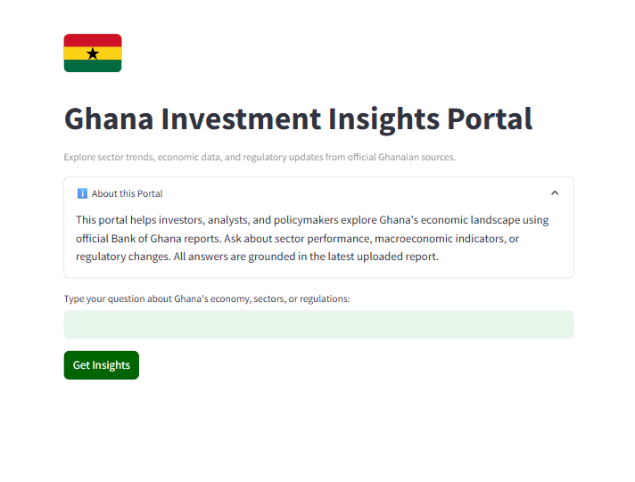
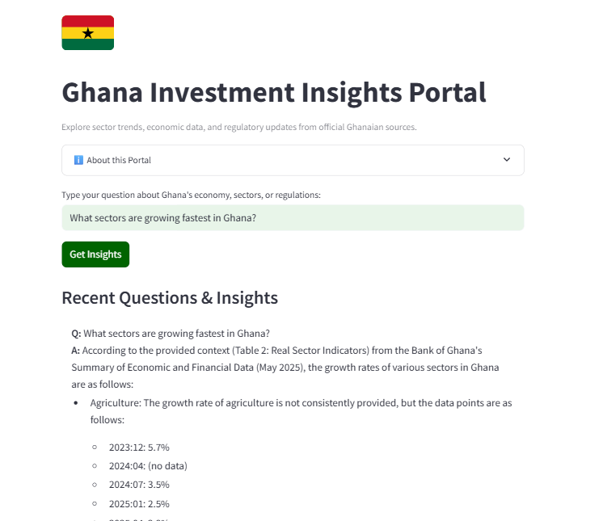

# Ghana Investment Insights Portal

## Abstract

This project presents a business-focused portal for exploring Ghana's investment landscape using official Bank of Ghana reports. Users can upload the latest PDF report and ask questions about sector trends, macroeconomic indicators, and regulatory changes. The system uses a Retrieval-Augmented Generation (RAG) pipeline with ChromaDB, HuggingFace embeddings, Groq LLM, and a custom Streamlit interface for a seamless, data-driven experience.

## Introduction

Investors and policymakers need timely, reliable insights to make informed decisions. This portal bridges the gap between raw financial data and actionable intelligence by allowing users to interact with official Bank of Ghana reports through natural language queries. The solution is designed for clarity, transparency, and business usability.

## Methodology

- **PDF Ingestion:** A [Bank of Ghana (Ghana's central bank) PDF report](https://www.bog.gov.gh/wp-content/uploads/2025/05/Summary-of-Economic-and-Financial-Data-May-2025.pdf) is uploaded into the data/ folder. The system extracts and splits the text into manageable chunks.
- **Embedding & Vector Storage:** Each chunk is embedded using HuggingFace's MiniLM model and stored in ChromaDB for fast retrieval.
- **Retrieval & Prompting:** User queries are embedded and matched to the most relevant chunks. The context is combined with a business-focused system prompt and sent to Groq LLM for answer generation.
- **User Interface:** The Streamlit UI is styled as a business portal with the layout tailored for professional users.

---

## Screenshots





---

## Features

- Upload and analyze official Bank of Ghana PDF reports
- Ask questions about Ghana's economy, sectors, or regulations
- Get answers grounded in real, up-to-date data
- Clean, business-focused web interface (Streamlit)
- Persistent vector search with ChromaDB

---

## Example Questions

- What sectors are growing fastest in Ghana?
- What is the current inflation rate?
- What are the latest trends in the banking sector?

---

## Project Structure

```
RAGchatbot/
├── app.py                # Streamlit UI (Ghana Investment Insights Portal)
├── requirements.txt      # Python dependencies
├── .env                  # For your GROQ_API_KEY
├── data/                 # Bank of Ghana PDF report is placed here
├── screenshots/          # App screenshots
├── src/
│   ├── main.py           # Core pipeline: PDF ingestion, embedding, retrieval
```

---

## Installation & Usage

1. **Clone the repository**
2. **Install dependencies**:
   ```bash
   pip install -r requirements.txt
   ```
3. **Set up your environment**:
   - Copy `.env_example` to `.env` and add your Groq API key:
     ```env
     GROQ_API_KEY=your-groq-api-key-here
     ```
   - Place your Bank of Ghana PDF in the `data/` folder (e.g., `Summary-of-Economic-and-Financial-Data-May-2025.pdf`).
4. **Run the portal:**
   ```bash
   streamlit run app.py
   ```

---

## License

MIT
