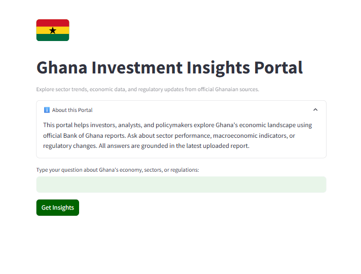

# Ghana Investment Insights Portal

This portal helps investors, analysts, and policymakers explore Ghana's economic landscape using official Bank of Ghana reports. Ask about sector performance, macroeconomic indicators, or regulatory changes. All answers are grounded in the latest uploaded report.

---

## Screenshots




---

## Features

- Upload and analyze official Bank of Ghana PDF reports
- Ask questions about Ghana's economy, sectors, or regulations
- Get answers grounded in real, up-to-date data
- Clean, business-focused web interface (Streamlit)
- Persistent vector search with ChromaDB

---

## Project Structure

```
RAGchatbot/
├── app.py                # Streamlit UI (Ghana Investment Insights Portal)
├── requirements.txt      # Python dependencies
├── .env                  # For your GROQ_API_KEY
├── data/                 # Place your Bank of Ghana PDF here
├── screenshots/          # App screenshots
├── src/
│   ├── main.py           # Core pipeline: PDF ingestion, embedding, retrieval
```

---

## Installation

1. **Clone the repository**
2. **Install dependencies**:
   ```bash
   pip install -r requirements.txt
   ```
3. **Set up your environment**:
   - Copy `.env_example` to `.env` and add your Groq API key:
     ```env
     GROQ_API_KEY=your-groq-api-key-here
     ```
   - Place your Bank of Ghana PDF in the `data/` folder (e.g., `Summary-of-Economic-and-Financial-Data-May-2025.pdf`).

---

## Usage

Start the portal:

```bash
streamlit run app.py
```

Open the local URL in your browser. Type your question and click "Get Insights". The portal will answer using only the uploaded Bank of Ghana report.

---

## Example Questions

- What sectors are growing fastest in Ghana?
- What is the current inflation rate?
- What are the latest trends in the banking sector?

---

## License

MIT
